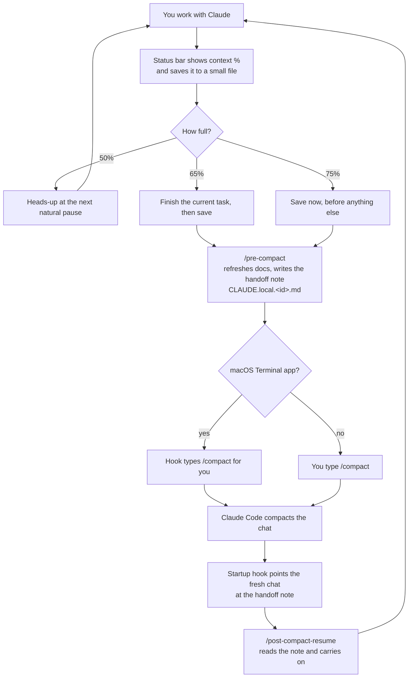
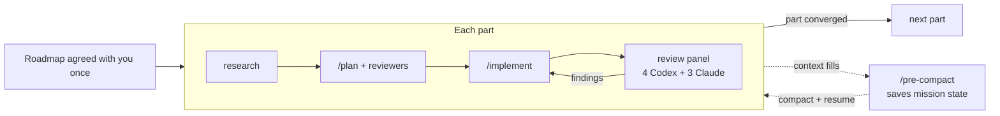
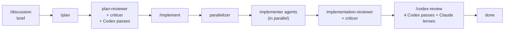

# How it works

omid_skills is a set of commands, helper agents, rules and small background scripts ("hooks")
that plug into Claude Code. This page explains the two ideas that hold it together: **long
sessions that survive compaction**, and **reviewers between every step**.

## 1. The long-session loop

Every Claude chat has a limited memory, its context. When it fills up, Claude Code compacts the
chat into a short summary and the fine details are lost. The kit makes that moment a planned
handover instead of an accident.

Step by step:

1. **The meter.** The status bar script shows how full the chat is and writes that number to
   `~/.claude/progress/ctx-<session id>.txt`. Everything else reads that file. (If you kept your
   own status bar, a small wrapper still writes the file, so the reminders keep working.)
2. **The nudges.** Before each of your messages, a hook checks the number. At 50% it's a
   heads-up, at 65% Claude finishes the current task and then saves, and at 75% saving comes first.
   A last safety hook fires just before any automatic compaction.
3. **The handoff.** `/pre-compact` refreshes your project docs and writes a handoff note in your
   project folder: the active task, the plan, decisions and why, what was tried, what's left.
   Notes chain to the previous one, so a long build keeps its whole story.
4. **The compaction.** In the macOS Terminal app, a hook types `/compact` into your window once
   Claude stops. (The first time, macOS asks whether Claude Code may control Terminal; allow it.)
   In VS Code, Cursor, iTerm, Ghostty or any other app, this step is off, and you type `/compact`
   yourself when `/pre-compact` says it's done.
5. **The resume.** When the fresh chat starts, a startup hook points it at the handoff note, and
   `/post-compact-resume` reads it and picks up exactly where things stopped. If the automatic
   resume doesn't fire, the startup banner shows the exact command to type.

## 2. /mission: the bridge across many compactions

`/mission` is for builds too big for one chat. It keeps a **mission file** on disk (the roadmap,
which part is in progress, which phase it's in, what's done) and updates it at every step.

Because the mission file survives compaction, the resumed chat reads it and continues the same
part at the same phase. Hooks keep an unattended mission moving: one asks you, as soon as you're
back, any questions the mission wrote down while you were away, and one catches a turn that
ended without scheduling its next step. That's how a single build can run for hours (tested up
to 23 hours non-stop). Opt-in and heavy; overkill for small work, unbeatable for big ones.

## 3. Reviewers between every step

No step grades its own work alone. Each command hands its output to independent reviewers before
the next step starts.

- **plan-reviewer** checks the plan for gaps and simpler routes. **criticer** asks the bigger
  question: is this actually good? What's the cheapest win, and what's over-built?
- **parallelizer** decides which pieces can safely be built at once, and a check after each batch
  stops everything if a helper touched a file it wasn't given.
- **implementation-reviewer** compares the finished work to the plan, line by line.
- **/codex-review**, **/god-report** and **/god-review** are the same idea at bigger sizes, from
  one change up to the whole codebase. The god-* commands use `review-worker` agents.

Two different models reviewing each other catch what one model alone misses. That's why Codex is
recommended.

## 4. Without Codex

Codex is optional. When it isn't installed (or can't run), a Claude stand-in, the
`codex-fallback-reviewer` agent, reads the same review instructions and fills the Codex slot.
Reports label those passes `(claude-fallback)`, so pipelines, pass counts and `/mission`'s review
panel work unchanged.

What you lose is the cross-check. Steps whose only job is to have the *other* model verify
Claude's findings (the "Codex validates Claude" step in `/god-review`, the verification pass in
`/codex-review`) are skipped instead of faked, and the findings they would have checked are
tagged `(unverified — no second model)`. Build steps that would have gone to Codex go to Claude's
`implementer` agent. Full procedure: [codex-fallback.md](codex-fallback.md).

## 5. Where things live

| Path | What it is |
|---|---|
| `~/.claude-kit/` | This repo. Hooks run from here. |
| `~/.claude/commands/`, `agents/`, `rules/` | Links to the kit's files, one per file, next to any of your own. |
| `~/.claude/settings.json` | Your settings, with the kit's hooks merged in (backup taken first). |
| `~/.claude/CLAUDE.md` | Your rules, plus one marked line that loads the kit's `CLAUDE.md`. |
| `~/.claude/.kit-install.json` | The record of everything the kit added, so updates and uninstall are exact. |
| `~/.claude/progress/` | The context-% files the meter writes. |
| `<your project>/CLAUDE.local.<id>.md` | Handoff notes from `/pre-compact`. |
| `<your project>/tmp/` | Briefs, plans, finished plans and review reports. |
